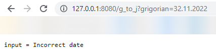
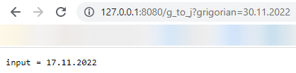
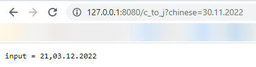
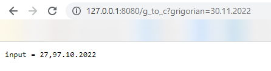

# Date-Converter

## How to use

Преобразование григорианского календаря в юлианский
``` 
0.0.0.0:8080/g_to_j?grigorian=<ваша дата>
```
Преобразование григорианского календаря в китайский
``` 
0.0.0.0:8080/g_to_c?grigorian=<ваша дата>
```
Преобразование юлианский календаря в григорианский
``` 
0.0.0.0:8080/j_to_g?julian=<ваша дата>
```
Преобразование юлианский календаря в китайский
``` 
0.0.0.0:8080/j_to_c?julian=<ваша дата>
```
Преобразование китайского календаря в григорианский
``` 
0.0.0.0:8080/c_to_g?chinese=<ваша дата>
```
Преобразование китайского календаря в юлианский
``` 
0.0.0.0:8080/c_to_j?chinese=<ваша дата>
```

## How to run with docker
Clone repository:
``` console
$ git clone https://github.com/ivannmm/Date-Converter-2.git
```
CD into app folder:
``` console
$ cd Date-Converter-2
```
Build docker image:
``` console
$ docker build -t date-convert
```
Run docker image:
``` console
$ docker run -p 8080:8080 date-convert
```

## Examples
1. Проверка на корректность даты:
   

2. Примеры конвертации даты:
   
   
   